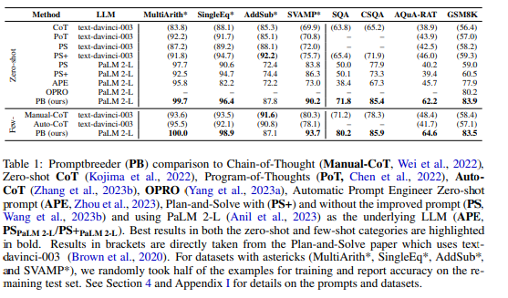

Paper: [PROMPTBREEDER: SELF-REFERENTIAL SELF-IMPROVEMENT VIA PROMPT EVOLUTION](https://arxiv.org/pdf/2309.16797v1.pdf)

Notes
- System which evolves prompt, requires description and prompt is generated
- self-referential and self improving
- chain of thoughts , tree of thoughts, handcrafted prompt techniques, current method is not manual and have capability to evolve step by step
- initial population of thinking style, task prompt and mutation prompt. 3 prompts. thinking style (list of thinking styles). problem description prompt. mutation prompts (prompt to prompt via mutation). in simple words we will use llm to make better prompt, those instructions are called as mutation prompt
- final prompt is thinking prompt + problem description prompt + Mutation prompt
- the problem description prompt and Mutation prompt both are going to change
- mutation is evaluated based on the new prompts produced from old prompts
- 

Thoughts
- Good direction to think and might be way forward, however does not solve problem fully

keywords learn/search
- diversity of solution

ref
- [Yannic Kilcher](https://www.youtube.com/watch?v=tkX0EfNl4Fc&t=384s&ab_channel=YannicKilcher)