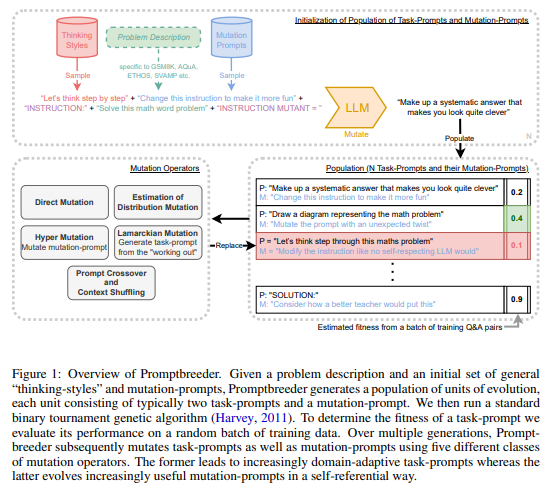

*Image 1 Caption*

Introduction: Provide a brief introduction to your blog post.

## Section 1: Heading

Write the main content of your blog post here. You can use various Markdown elements like:

- Lists
- Links
- Images
- Code snippets (with syntax highlighting)
- Quotes

### Subsection 1.1: Subheading

More detailed content goes here.

```python
# Example code snippet
def hello_world():
    print("Hello, world!")

hello_world()
```

## Section 2: Another Heading

Continue writing your blog post.

## Conclusion

Summarize the key points discussed in your blog post.

## Author

- Name: Your Name
- Website: [Your Personal Website](https://yourwebsite.com)
- Twitter: [@yourtwitterhandle](https://twitter.com/yourtwitterhandle)

Feel free to reach out if you have any questions or comments about this blog post!
