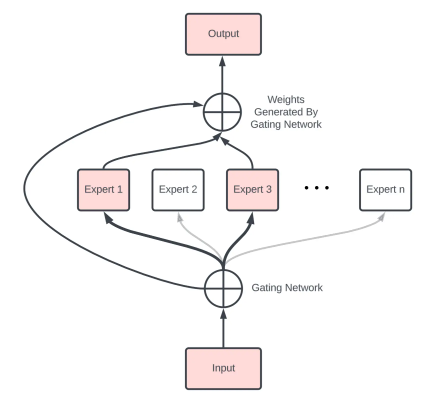

## Table of Contents
- [Table of Contents](#table-of-contents)
- [Introduction](#introduction)
- [The Mixture of Experts (MoE) Approach](#the-mixture-of-experts-moe-approach)
  - [What is a Mixture of Experts (MoE)?](#what-is-a-mixture-of-experts-moe)
  - [Why opt for a Mixture of Experts (MoE)?](#why-opt-for-a-mixture-of-experts-moe)
- [The Router's Role in MoE](#the-routers-role-in-moe)
- [Training a Mixture of Experts](#training-a-mixture-of-experts)
- [The Expert Selection Challenge](#the-expert-selection-challenge)
- [Where is MoE Useful?](#where-is-moe-useful)
- [The Fast Feed Forward Networks or Binary Tree Networks](#the-fast-feed-forward-networks-or-binary-tree-networks)
- [Conclusion](#conclusion)
- [Reference](#reference)

## Introduction
Everyone loves the surprise element that science brings with its progress. While we were awestruck by GPT-3, introduced by OpenAI in late 2022, the dawn of 2023 brought forward a behemoth called GPT-4.  

In contrast to GPT-3, GPT-4 supposedly utilizes a "Mixture of Experts" (MoE) approach, implying that it uses a series of parallel models instead of a single one. The decision of which model to use is determined by a router.  

Join me as we unravel this intriguing subject.

## The Mixture of Experts (MoE) Approach
### What is a Mixture of Experts (MoE)?
- A MoE uses multiple models in parallel.
- A router chooses which model to use at inference time.

### Why opt for a Mixture of Experts (MoE)?
- Traditional GPT models like GPT-3 use every single neuron for predictions.
- As models enlarge, they require more neurons and hence more computational power.
- Yet, a smaller set of neurons significantly contribute to predicting the next token.
- To optimize, splitting a single model to several parallel ones would save computational effort when you query a particular topic of expertise, using only one column, not the entire model.

## The Router's Role in MoE
- A router makes decisions based on the inputs.
- It simplifies computation by directing the inputs to a model with the fitting expertise.
- The router predicts the probability of each expert being chosen.

## Training a Mixture of Experts
- The system starts with separate models and a router choosing between them.
- The router predicts which expert to use based on an input batch.
- The system forward passes through the selected model to produce output token predictions.
- A loss is calculated based on the difference between the predicted and actual tokens.
- This loss then backpropagates through the models and the router.

## The Expert Selection Challenge
- The training process can lead to one expert becoming more robust than others.
- A strong expert can draw the majority of the data, leaving other experts underperforming.
- To mitigate this, we can introduce noise (randomness) to the model selection.
- The system penalizes the router for uneven choices among experts, incentivizing uniform distribution.
- The objective is achieving a uniform strength across all experts.

## Where is MoE Useful?
- MoE can speed up inference on edge devices like laptops, but won't shrink the model size.
- At an enterprise scale, MoE provides a fraction of inference cost since a single expert does the processing instead of a whole standard model.
- However, a high volume of requests is needed for this efficient batching and routing.

## The Fast Feed Forward Networks or Binary Tree Networks
- An improvement upon the mixture of experts.
- Aims to replicate a balanced distribution of data among experts.
- Reduces the need for artificial noise during training.
- Results in a similar training time as a standard GPT but quicker inference.

## Conclusion
The Mixture of Experts (MoE) model offers exciting development and improvements in AI. With MoEs, systems like GPT-4 can potentially achieve faster inference. However, as they operate at a large scale, there will be challenges to ensure balanced, effective, and efficient operations. As we continue to explore and experiment, the journey towards further AI developments remains intriguing.

## Reference
- [Fast Feedforward Networks](https://arxiv.org/pdf/2308.14711.pdf)
- [Towards Understanding Mixture of Experts in Deep Learning](https://arxiv.org/pdf/2208.02813.pdf)
- [Trelis Research- Understanding Mixture of Experts](https://www.youtube.com/watch?v=0U_65fLoTq0&ab_channel=TrelisResearch)
- [Hierarchical Routing Mixture of Experts](https://arxiv.org/pdf/1903.07756.pdf)
