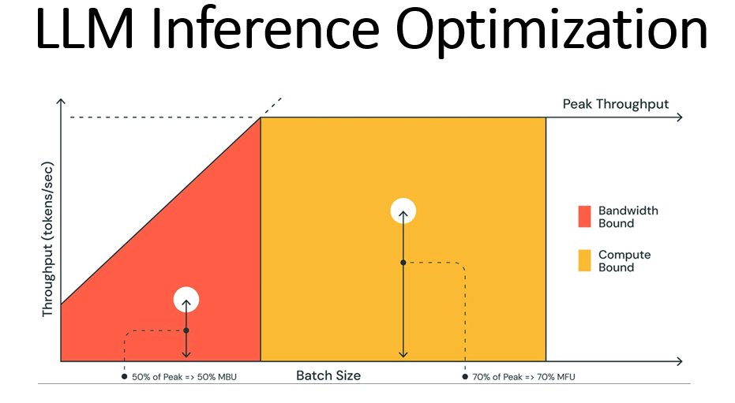

## Table of Contents
- [Table of Contents](#table-of-contents)
- [Introduction](#introduction)
- [Continuous Batching](#continuous-batching)
- [Speculative Batching](#speculative-batching)
- [Attention Mechanisms](#attention-mechanisms)
  - [Flash Attention 2](#flash-attention-2)
  - [Multi-head Attention (MHA)](#multi-head-attention-mha)
  - [Multi-query Attention (MQA)](#multi-query-attention-mqa)
  - [Group-query Attention (GQA)](#group-query-attention-gqa)
  - [Paged KV Cache for the Attention](#paged-kv-cache-for-the-attention)
- [KV Cache](#kv-cache)
  - [Prefill](#prefill)
- [Parallelism](#parallelism)
  - [Tensor Parallelism](#tensor-parallelism)
  - [Pipeline Parallelism](#pipeline-parallelism)
  - [Data Parallelism](#data-parallelism)
- [Optimizing](#optimizing)
  - [Quantization](#quantization)
    - [GPTQ](#gptq)
    - [AWQ](#awq)
  - [Distillation](#distillation)
  - [Pruning](#pruning)
- [FP8](#fp8)
- [Greedy-search](#greedy-search)
- [Beam-search](#beam-search)
- [RoPE](#rope)

## Introduction

LLM has made significant strides in recent years, with models becoming increasingly complex and powerful. However, with great power comes great computational cost. In this post, we'll delve into some of the advanced techniques that are pushing the boundaries of efficiency and performance in deep learning. 

## Continuous Batching

Continuous Batching is a technique that maximizes GPU utilization. It involves:

- **Streamlining computation**: By continuously feeding batches of data to the GPU.
- **Reducing idle time**: Ensures that the GPU always has work to do.
- **Enhancing throughput**: By minimizing the time spent waiting for I/O operations.

## Speculative Batching

Speculative Batching is a predictive approach that:

- **Pre-executes tasks**: Based on the likelihood of their necessity.
- **Saves time**: By preemptively processing data that will probably be needed.
- **Increases efficiency**: Through better resource utilization.
- Speculations can be runin parallel to validate

## Attention Mechanisms

Attention mechanisms have revolutionized the way neural networks process data. Let's look at some sophisticated variants:

### Flash Attention 2

- **High-speed processing**: Flash Attention 2 is designed for rapid computation.
- **Efficient memory usage**: It optimizes the use of memory bandwidth.
- Basis - "GPUs are good at computation rather than read and write" 
- Reduces the reads and writes, recomputes, partial softmax calculates to compensate

### Multi-head Attention (MHA)

- **Parallel processing**: MHA processes information in parallel across different representation subspaces.
- **Richer representations**: It captures various aspects of the data simultaneously.
- Each q have a seperate K and V

### Multi-query Attention (MQA)

- **Multiple queries**: MQA handles several queries in one go.
- **Enhanced context capture**: It allows the model to consider multiple perspectives at once.
- Single K and V across all attention heads
- This ia majorly to reduce the memory burden, KV cache, of the system.

### Group-query Attention (GQA)

- **Grouped processing**: GQA processes sets of queries together.
- **Improved relational understanding**: It's adept at understanding the relationships between different data points.
- Grouped K and V across all attention heads
- This ia majorly to reduce the memory burden, KV cache, of the system.

### Paged KV Cache for the Attention

- **Memory efficiency**: This technique uses a paged mechanism to store key-value pairs.
- **Faster access**: It allows for quicker retrieval of relevant information during the attention process.
- Reduces memory fragmentation loss
- Disdvantage - makes system memory bound

## KV Cache

### Prefill

- **Ready-to-use cache**: Prefill prepares the KV cache with relevant data before it's needed.
- **Reduces latency**: By ensuring that data is immediately available when the model requires it.
- Prefill can be done in batch to make most of compute available

## Parallelism

Parallelism is key to scaling deep learning models. Here are three types:

### Tensor Parallelism

- **Divides tensors**: It splits the computational workload across multiple GPUs.
- **Enables larger models**: By distributing the memory requirements.

### Pipeline Parallelism

- **Sequential stages**: It breaks the model into stages that are processed in sequence.
- **Continuous workflow**: Each GPU works on different stages simultaneously.

### Data Parallelism

- **Copies of the model**: Each GPU has its own copy of the model.
- **Synchronized learning**: They all learn from different subsets of the data.

## Optimizing

Optimization techniques refine the model's performance and efficiency:

### Quantization

#### GPTQ

- **Gradient-based**: GPTQ uses gradients to quantize weights without significant loss of accuracy.
- **Balances performance**: It maintains a balance between model size and effectiveness.

#### AWQ

- **Adaptive**: AWQ adjusts quantization levels based on the data distribution.
- **Resource-efficient**: It aims to use fewer bits where possible without compromising quality.

### Distillation

- **Knowledge transfer**: Distillation involves teaching a smaller model to mimic a larger one.
- **Compact models**: The result is a more efficient model that retains much of the performance.

### Pruning

- **Removes redundancy**: Pruning cuts out unnecessary weights or neurons.
- **Streamlines models**: It leaves a leaner, faster model that requires less computation.

## FP8

- **Half-precision format**: FP8 is a new floating-point format that uses only 8 bits.
- **Saves memory**: It significantly reduces the memory footprint of models.
- **Maintains precision**: Despite its size, it's designed to retain as much precision as possible.

## Greedy-search

- **One step at a time**: Greedy-search selects the best option at each step without looking ahead.
- **Fast and simple**: It's a straightforward approach that can be very efficient.

## Beam-search

- **Explores multiple paths**: Beam-search keeps track of several of the best options at each step.
- **Balances breadth and depth**: It's more thorough than greedy-search but also more computationally intensive.

## RoPE

- **Rotary Positional Embedding**: RoPE encodes the position information into the attention mechanism.
- **Enhances understanding**: It helps the model better understand the order and relationship of elements in

Stay tuned, as I will be explaining each of these points in detail in upcoming posts, providing a deeper understanding of how they contribute to the cutting-edge of deep learning technology.