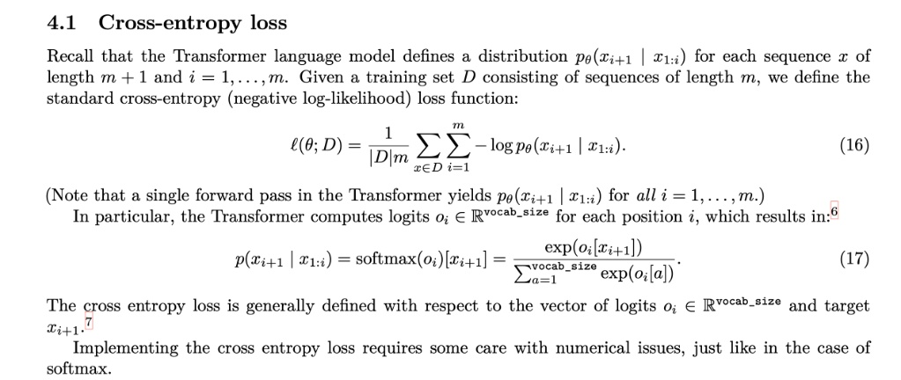



#### The Simple Idea "How Surprised is the Model?"

In short, **cross-entropy loss** is a way to measure how "bad" or "wrong" a language model's prediction is.

Think of it like this:
* You're training an LLM on the sentence: "The cat sat on the **mat**."
* You feed the model the words "The cat sat on the" and ask it to predict the next word.
* The model doesn't just guess one word. It outputs a probability for *every possible word* in its vocabulary (e.g., "mat": 60%, "rug": 20%, "floor": 15%, "hat": 5%).
* The **correct** answer is "mat".
* Cross-entropy loss looks at `the probability the model assigned to the correct answer ("mat") and gives it a "penalty" score.
    * **Low Loss (Good):** If the model assigned a high probability (like 60%) to "mat", the loss is low. The model was not very "surprised."
    * **High Loss (Bad):** If the model assigned a very low probability (like 0.1%) to "mat", the loss is high. The model was *very* surprised, and this high loss score tells the training process to make a big adjustment.

The loss for a single prediction is simply the **negative logarithm** of the probability assigned to the correct word: \( \text{Loss} = -\log\big(p_{\text{correct\_word}}\big) \).

---

#### Walkthrough Example 🚀

Let's use a tiny, simplified example.

**Goal:** Predict the next word for "The cat sat on the ___".
**Correct Answer:** "**mat**"
**Our tiny vocabulary:** `[mat, hat, sat, rug]`

1.  **Get Logits (The Model's "Raw Scores"):**
    The Transformer processes the input "The cat sat on the" and outputs a vector of raw, un-normalized scores called **logits** (this is the \(o_i\) in your text). Let's say it outputs:
    `o = [3.2, 1.0, -0.5, 2.5]`
    (These scores correspond to `[mat, hat, sat, rug]`. A higher score means the model *thinks* that word is more likely).

2.  **Apply Softmax (Formula 17 - Get Probabilities):**
    We can't use these raw scores directly. We need probabilities that are all positive and add up to 1. That's what the **softmax** function does.

\[
p(x_{i+1} \mid x_{1:i}) = \frac{\exp\!\big(o_i[x_{i+1}]\big)}{\sum_{a=1}^{\text{vocab\_size}} \exp\!\big(o_i[a]\big)}
\]

    * **What it means:** "To get the probability for a specific word, take the exponential of that word's logit (\(e^{\text{logit}}\)) and divide it by the *sum* of the exponentials of *all* logits."
    * **Calculation:**
        * \(e^{3.2}\) (for "mat") \(\approx 24.53\)
        * \(e^{1.0}\) (for "hat") \(\approx 2.72\)
        * \(e^{-0.5}\) (for "sat") \(\approx 0.61\)
        * \(e^{2.5}\) (for "rug") \(\approx 12.18\)
        * **Total Sum:** \(24.53 + 2.72 + 0.61 + 12.18 = 40.04\)
    * **Final Probabilities (p):**
        * \(p(\text{"mat"})\): 24.53 / 40.04 = \(\mathbf{0.61\ (61\%)}\)
        * \(p(\text{"hat"})\): 2.72 / 40.04 = \(0.07\ (7\%)\)
        * \(p(\text{"sat"})\): 0.61 / 40.04 = \(0.01\ (1\%)\)
        * \(p(\text{"rug"})\): 12.18 / 40.04 = \(0.31\ (31\%)\)

3.  **Calculate Loss (The Core of Formula 16):**
    Now we calculate the loss for this *one prediction*. The correct word was "**mat**", which the model gave a **61%** probability.

    * **Loss:** \(-\log\big(p_{\text{correct\_word}}\big)\)
    * **Loss:** \(-\log(0.61) \approx \mathbf{0.49}\)

    This score, 0.49, is the cross-entropy loss for this single step. The training process would then use this number to adjust the model's parameters so that next time, it will hopefully output an even higher logit for "mat" in this context.

---

#### Explaining the Formulas 🔬

#### Formula (17): Softmax
\[
p(x_{i+1} \mid x_{1:i}) = \mathrm{softmax}(o_i)[x_{i+1}] = \frac{\exp\!\big(o_i[x_{i+1}]\big)}{\sum_{a=1}^{\text{vocab\_size}} \exp\!\big(o_i[a]\big)}
\]

* **\(p(x_{i+1} \mid x_{1:i})\):** This is just fancy notation for "the probability \(p\) of the next word \(x_{i+1}\) *given* all the previous words \(x_{1:i}\)." (e.g., the probability of "mat" given "The cat sat on the").
* **\(o_i\):** The vector of raw **logits** (scores) from the model for position \(i\).
* **\(\exp(o_i[x_{i+1}])\):** The exponential of the logit for the *single word* we care about (e.g., \(e^{3.2}\) for "mat").
* **\(\sum_{a=1}^{\text{vocab\_size}} \exp(o_i[a])\):** The "normalization term." It means "take the exponential of the logit for *every word* in the entire vocabulary (from \(a=1\) to `vocab_size`) and **add them all up**." (e.g., \(e^{3.2} + e^{1.0} + e^{-0.5} + e^{2.5}\)).

**In one sentence:** This formula converts the model's raw logits into a clean probability distribution that sums to 1.

#### Formula (16): The Overall Loss Function
\[
\ell(\theta; D) = \frac{1}{|D|} \sum_{x \in D} \sum_{i=1}^{m} -\log p_\theta(x_{i+1} \mid x_{1:i})
\]

This formula looks intimidating, but it's just adding up all the individual losses and taking the average. Let's read it from the inside out:

1.  **\(-\log p_\theta(x_{i+1} \mid x_{1:i})\)**
    * This is the **core loss for one word**, just like we calculated: \(-\log(0.61) \approx 0.49\). It's the negative log of the probability (calculated from Formula 17) that the model assigned to the *actual correct word* (\(x_{i+1}\)).

2.  **\(\sum_{i=1}^{m} ...\)**
    * This says to **sum** ( \(\sum\) ) the losses for *every word* in a single sequence (from the first word \(i=1\) to the last word \(m\)).
    * For "The cat sat on the mat", you'd calculate:
        * Loss for predicting "cat" (given "The")
        * + Loss for predicting "sat" (given "The cat")
        * + Loss for predicting "on" (given "The cat sat")
        * + Loss for predicting "the" (given "The cat sat on")
        * + Loss for predicting "mat" (given "The cat sat on the")

3.  **\(\sum_{x \in D} ...\)**
    * This says to do step 2 for **every single sequence \(x\) in the entire dataset \(D\)** and add *all* those sequence-losses together. This gives you one giant number representing the total loss for the whole dataset.

4.  **\(\frac{1}{|D|} ...\)**
    * This just means "**take the average**." Divide that giant total loss by \(|D|\), which is the number of sequences in your dataset.

**In one sentence:** This formula calculates the **average loss per sequence** across the entire training dataset, which gives the model a single "grade" for how well it's doing.

