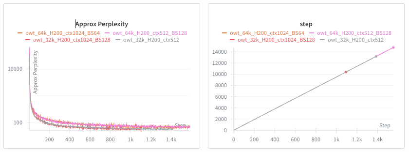
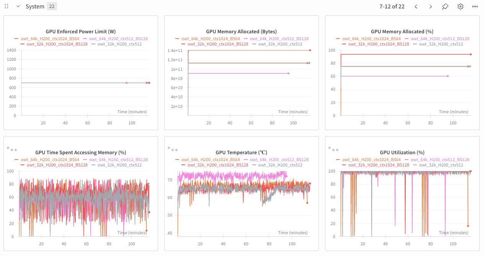
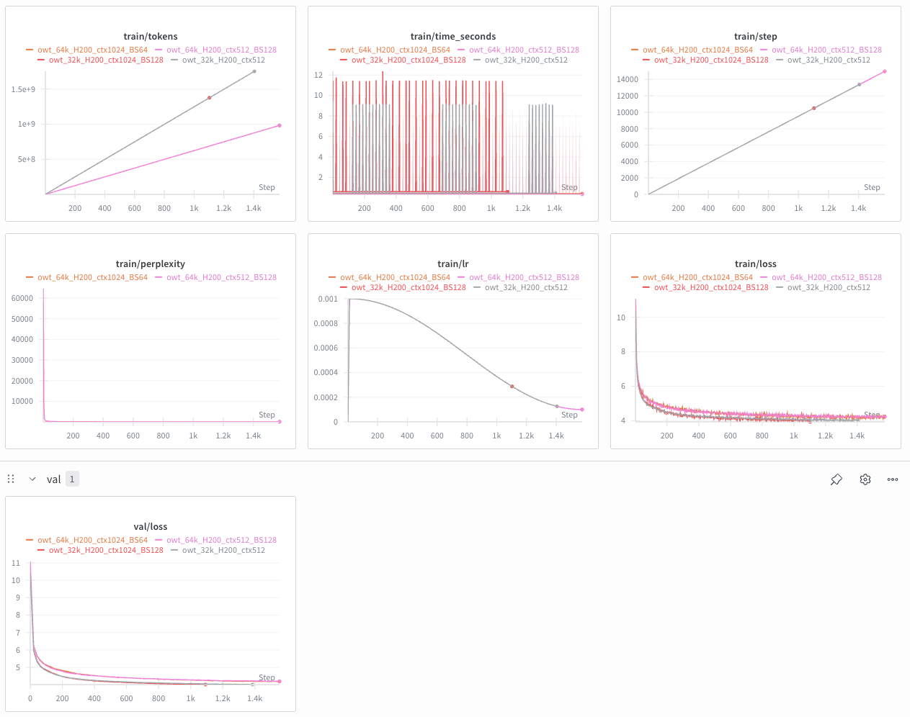



#### Goal

Investigate whether doubling context length (512 → 1024) while halving batch size (256 → 128) improves model performance when total tokens per step remains constant (~131k).

#### Reference

- Repository: [SDcodehub/LM-training](https://github.com/SDcodehub/LM-training)

#### The Core Question

Does longer context improve performance if we must halve batch size to maintain similar memory/compute constraints?

Both runs process **131,072 tokens per optimization step**:
- **Baseline:** $256 \times 512 = 131,072$ tokens
- **Experiment:** $128 \times 1024 = 131,072$ tokens

#### Experiment Configuration

| Feature | Baseline (Grey) | Experiment (Red) | Notes |
|:---|:---|:---|:---|
| Run Name | `owt_32k_H200_ctx512` | `owt_32k_H200_ctx1024_BS128` | |
| Context Length | 512 | 1024 | Primary variable |
| Batch Size | 256 | 128 | Compensation variable |
| Model Size | ~20.58M Params | ~20.58M Params | 4 Layers, 256 d\_model, 8 Heads |
| Dataset | OpenWebText (v2) | OpenWebText (v2) | Vocab size 32,000 |
| Hardware | H200 GPU | H200 GPU | |
| Max Iters | 15,000 | 15,000 | |

#### Model Architecture

The architecture is a compact transformer:
- **Layers:** 4
- **Embedding Dim:** 256
- **Heads:** 8
- **Tokenizer:** BPE (32k vocab)
- **Total Parameters:** ~20.58M

#### Results

##### Loss Convergence

<!-- PLACEHOLDER: Add wandb val/loss comparison graph -->

The validation loss curves are nearly identical. Both runs converged smoothly to similar final loss values. At this model scale ($d_{model} = 256$), the attention mechanism neither struggles with 1024 tokens nor gains significant benefit from the extended context.

##### Perplexity

Both models learned the probability distribution at the same rate, confirming the loss equivalence.

##### System Utilization

The system graphs reveal the cost of longer context:
- **Memory Usage:** ctx1024 (Red) allocated ~141 GB VRAM; ctx512 (Grey) used ~115 GB
- **GPU Utilization:** Both runs maintained high utilization with steady clock speeds
- **Stability:** H200 handled the increased memory load without instability

#### Qualitative Results

Text generation samples using prompt *"Once upon a time"*:

**Baseline (ctx 512)**
> """Once upon a time of great joy, the adventure was exciting.The discovery of a highly successful adventure, the embitant was just a game called The Tor. It has been a long awaited adventure at the heart of the exploration and survival of this discovery. It is part of the adventure that we have been putting ourselves together and we look forward to what we have, and we have had to accept what we had to do."""

The model stays on topic (adventure/joy) but is repetitive and generic. Structure mimics a story well.

**Experiment (ctx 1024)**
> "Once upon a time-traveled piece of the Star Wars, it really should have been a first glimpse of a new trailer. The game is not just a games-wide move but a safe way to go along with a consistent and frustrating attitude. In the end, the trailer has been very hard to see in the game, but it's a great thing for a long time to be a fan of the game. KDX (50) (not the only games-wide appearance on the card"

The 1024 model hallucinated a specific entity ("Star Wars") and adopted a review-like tone. While one sample is not statistically significant, the longer context model generated slightly more complex sentence structure.

#### Key Findings

1. **Loss equivalence:** Doubling context from 512 to 1024 while halving batch size produces identical loss curves at this scale
2. **Memory cost:** Longer context increases VRAM usage (~115 GB → ~141 GB)
3. **Stability:** The 1024 context configuration is stable on H200 without divergence
4. **Trade-off neutral:** At ~20M parameters, the benefit of longer context roughly equals the benefit of more diverse examples per step

#### Conclusion

This ablation demonstrates that **doubling context length to 1024 is stable** for this architecture. While it did not produce lower loss compared to the higher batch size baseline, the model successfully handles longer sequences without diverging.

For future scaling, since loss is equivalent, the **ctx 1024** model may be preferred because it handles longer user prompts at inference time, provided sufficient VRAM is available.

#### Next Steps

- Visualize attention patterns to verify if the 1024-context model attends to tokens beyond position 512
- Scale up model size to test if larger models benefit more from extended context
- Extend training beyond 15k iterations to observe late-stage divergence behavior

